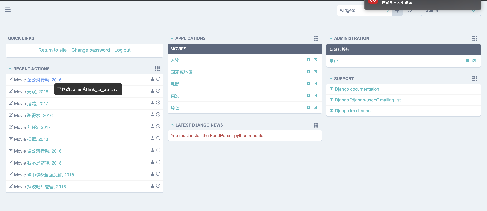
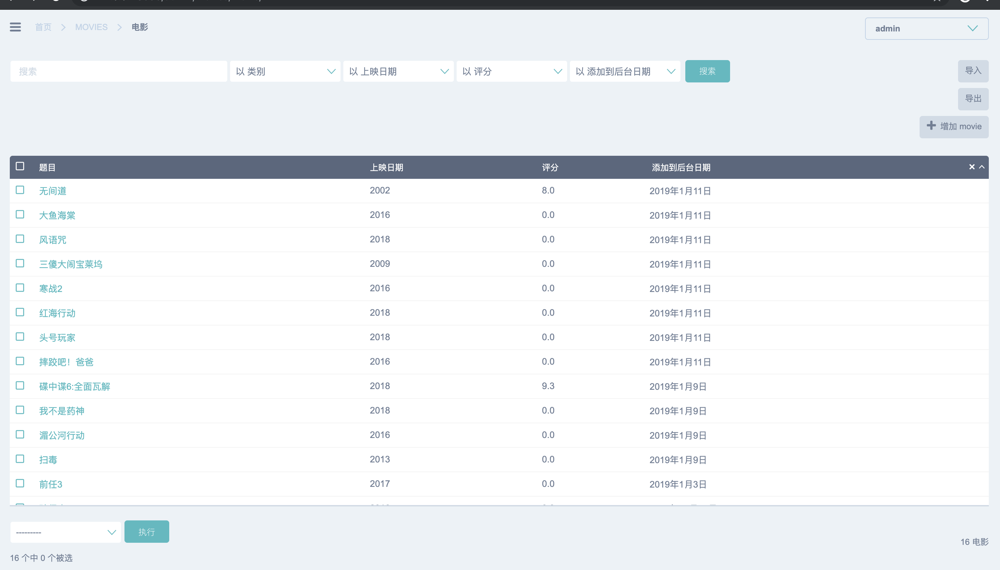
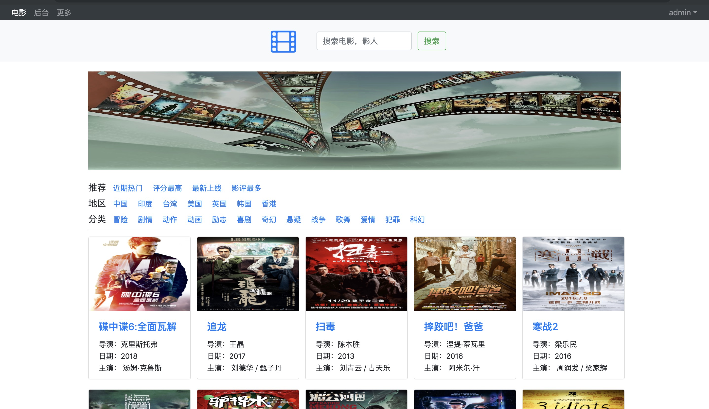
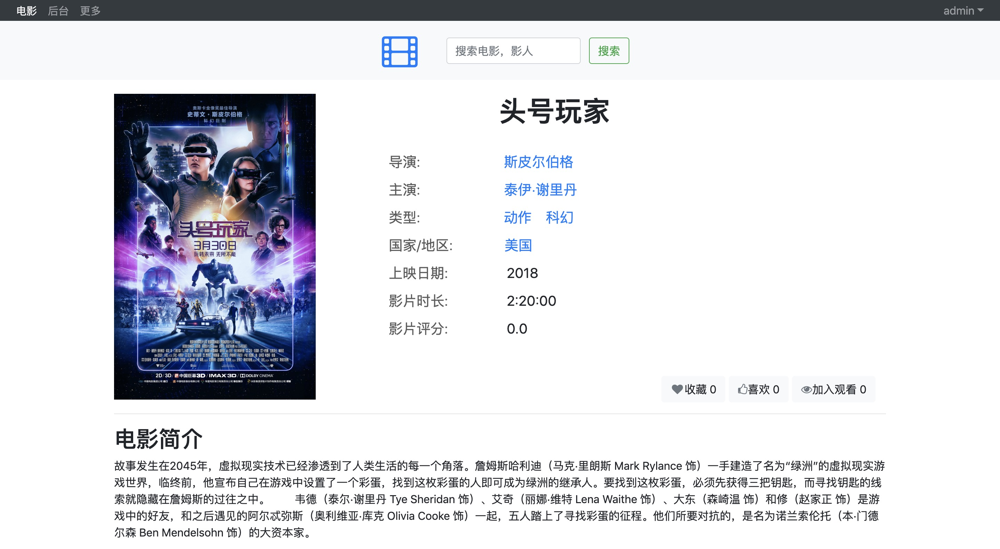
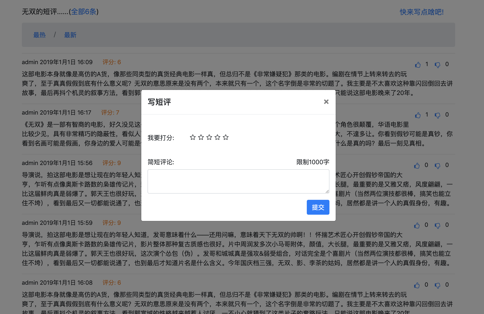

## django_movie

### 功能
- 用户登陆,注册,查看个人主页
- 搜索,浏览电影信息,人物信息
- 在线观看电影，提供vip连接
- 评论,点赞,收藏相关电影
- 后台轻松管理相关电影信息
- docker快速部署服务

### 依赖
    python3.6
    django2.1.1  
    django-jet  
    bootstrap4
    font_awesome
    jquery
    docker 
    
### git安装部署
    git clone https://github.com/wuljchange/django_movie.git
    pip3 install -r requirements.txt
    python3 manage.py runserver 0.0.0.0:8090

### docker部署
    docker login
    docker run -d -p 8090:8090 wuljchange/django-movie:v1.0.0

### 效果图
- 后台主页

- 后台添加电影

- 用户登录

- 用户注册

- 网站主页

- 电影详细页面

- 观看电影

- 评论及评分

- 人物介绍

### 反馈
- wuljchange@outlook.com
- wuljfly@icloud.com

### 感谢
Reference program is https://github.com/VladKha/MovieNet.git and thank you very much!
